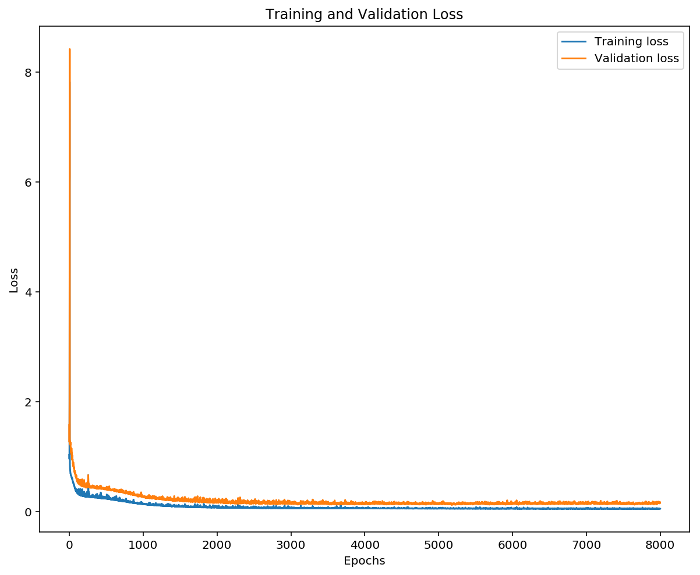
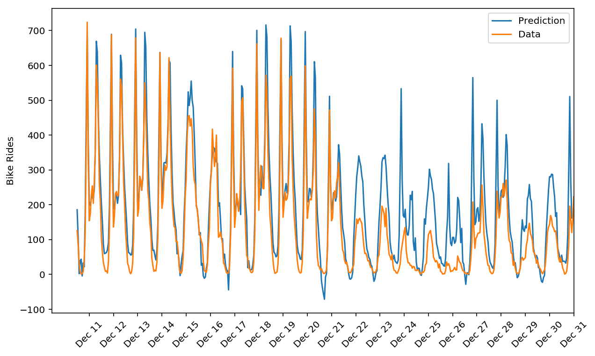

# Bike-Sharing Patterns

This project is designed to predict the patterns of bike-sharing rides. There are a lot of bike-sharing companies
exploring this market, and it's important to understand the patterns through the rides to, given a period of time, do
not hold on too many bikes with fewer costumers (wasting money to maintain unused bikes) or to have enough bikes
to fulfill all your customers. This project tries to predict on historical data (of daily rides) how many bikes a 
bike-sharing company would need on the near future using a neural network.

## Historical Data

The historical data is from the *Laboratory of Artificial Intelligence and Decision Support (LIAAD)* based on Porto,
Portugal. The dataset that is used on this project contains information about the bike-sharing rides on a daily basis,
and it has 731 entries (or 731 days). Those entries have been collected between the beginning of 2011 until the end 
of 2012.

## Solution

The solution developed on this notebook is a Neural Network with one hidden layer, developed using only `numpy` (and
`pandas` for data cleaning). The network loss during it's training can be seen on the image below:

  

And the prediction of our network on the test set can be seen on the image below:

    

The solution, and the possible problems with the model, are explained both on the Jupyter Notebook on this repository 
`bike_sharing.ipynb`, and the Neural Network structure and parameters at the file `network.py`.
